# 🎬 Movie C17 App

A premium Movie Exploration & Booking application built with **Flutter**. This project demonstrates an expert-level implementation of **Clean Architecture**, **State Management (Bloc)**, and a complex **6-step Onboarding flow** with a comprehensive **User Account System**.

---

## 📸 Screenshots

Here is a visual overview of the application modules and the full user experience flow.

### 🌟 Immersive Onboarding (6 Steps)
A guided experience to discover, create, and rate content using `PageView` logic.

| Step 1: Favorite & Step 2: Discover | Step 3: Explore & Step 4: Create | Step 5: Rate & Step 6: Finish |
| :---: | :---: | :---: |
| 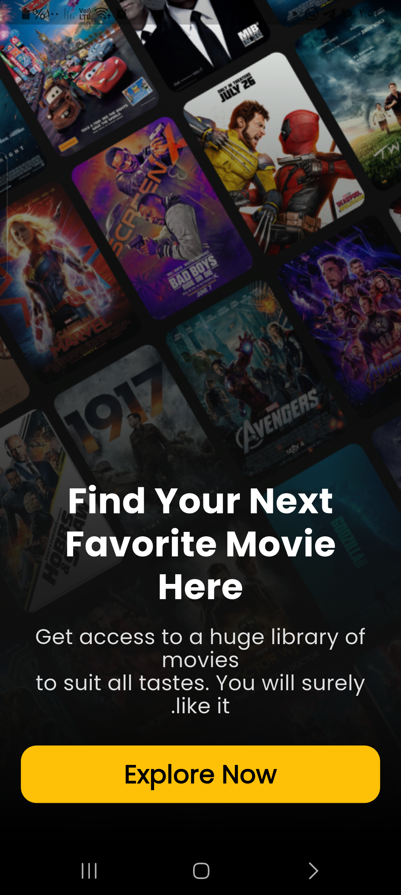 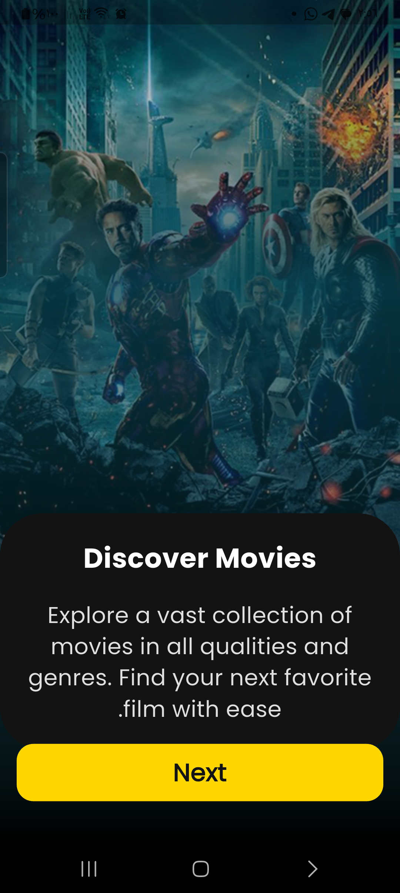 | 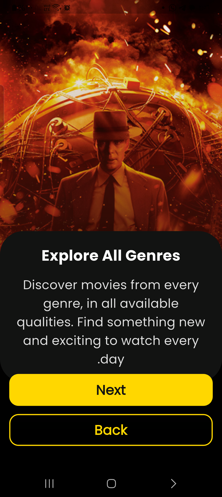 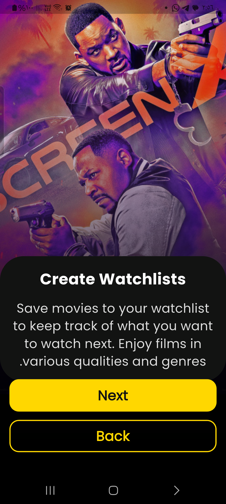 | 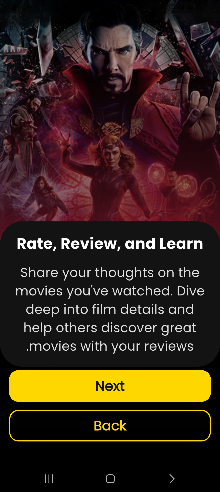 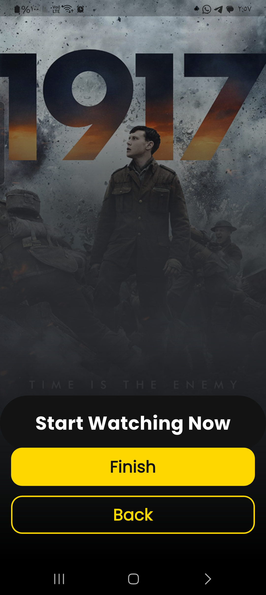 |

### 🍿 Home & Discovery Flow
| Home Screen | Browser | Search Screen |
| :---: | :---: | :---: |
| 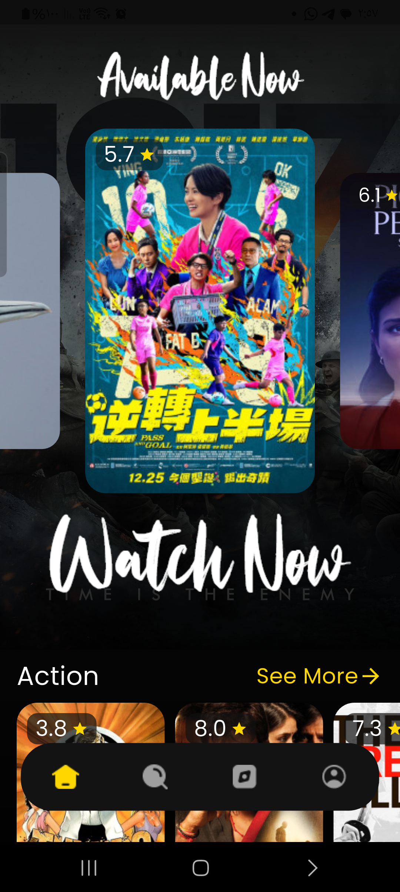 | 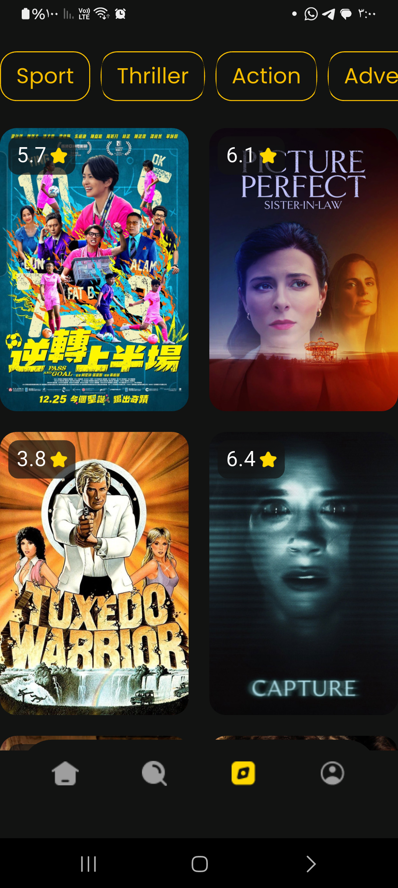 | 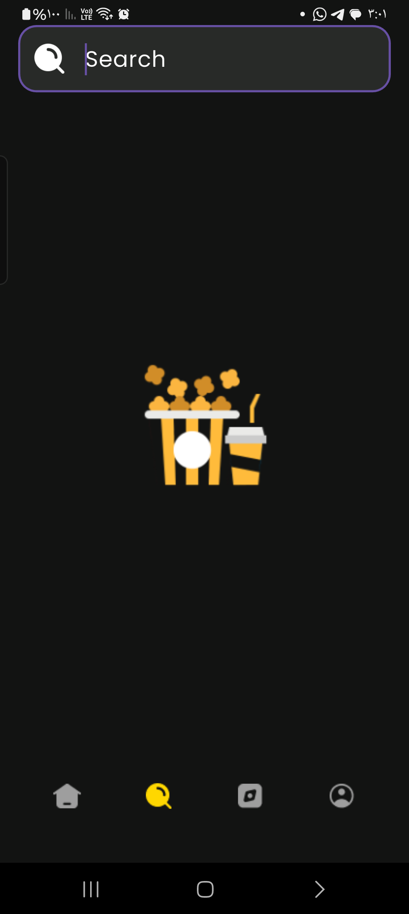 |

### 🔎 Movie Details (2 Views)
In-depth content information managed via the dedicated `details` module.

| Cast & Story | Technical & Recommended |
| :---: | :---: |
|  | 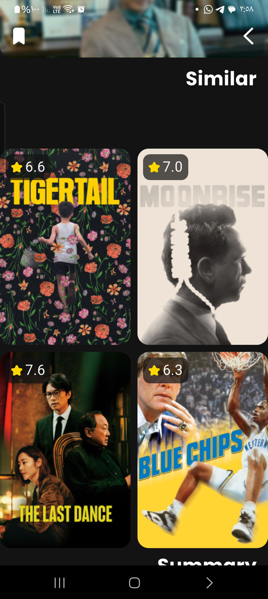 |

### 👤 Profile & Edit Flow (2 Views)
Complete user profile management with Firebase real-time sync.

| Profile Summary | Edit Information Form |
| :---: | :---: |
| 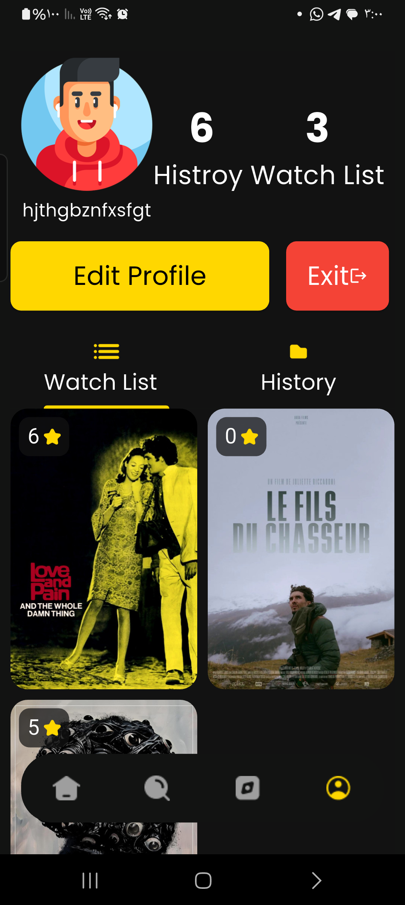 | 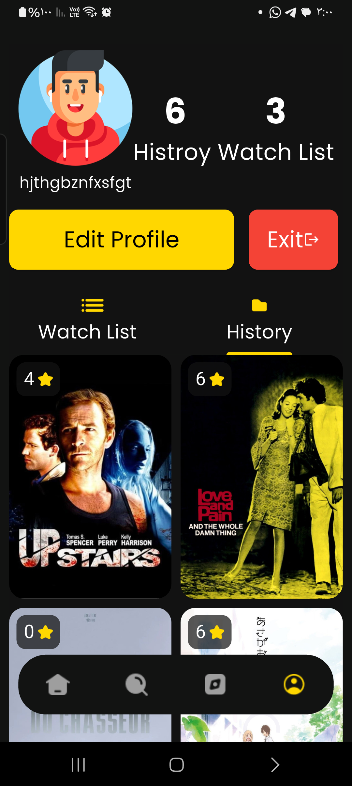 |

> **Note:** Place all images in the `/screenshot` folder at the root of the project. Ensure exact filename matching.

---

## ✨ Key Features (Clean Architecture)

### 🚀 Onboarding
* **Dynamic sequentially Pages:** Uses `PageView` and `PageController` for a smooth onboarding.
* **Smart Navigation:** Dynamic Back button visibility after step 2 and Finish button conversion.

### 👤 Profile & Personalization
* **Real-time Synchronization:** Fetches user data directly from **Firebase Auth** & **Firestore**.
* **Edit Profile:** Dedicated form module for updating personal details and preferences.

### 🏗 Architecture & State
* **Bloc (9.1+):** Strict state management based on events.
* **Clean Design:** Feature-based folder structure for maximum maintainability.
* **Routing:** Strongly typed navigation with **Auto Route (11.1+)**.

### 🌐 Data & Persistence
* **Hive & SharedPreferences:** High-performance local caching.
* **Networking:** Powerful API handling with **Dio** and debugging via **Pretty Dio Logger**.

---

## 🛠 Tech Stack

* **UI Framework:** Flutter (SDK >= 3.9.0)
* **Design:** `flutter_screenutil`, `google_fonts`, `carousel_slider`, `cached_network_image`.
* **Dependency Injection:** `get_it`, `injectable`.
* **Tools:** `auto_route`, `easy_localization`, `connectivity_plus`.

---

## 🚀 Installation

1. **Clone the repository:**
   ```bash
   git clone [https://github.com/Mohamed-Hessein/movie_c17.git](https://github.com/Mohamed-Hessein/movie_c17.git)
